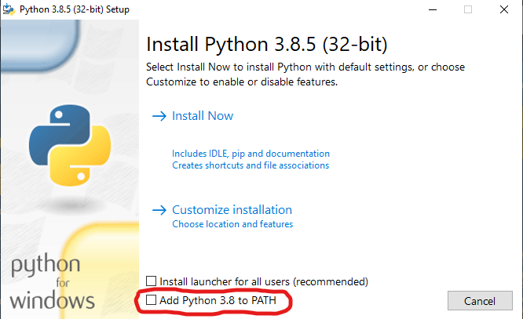
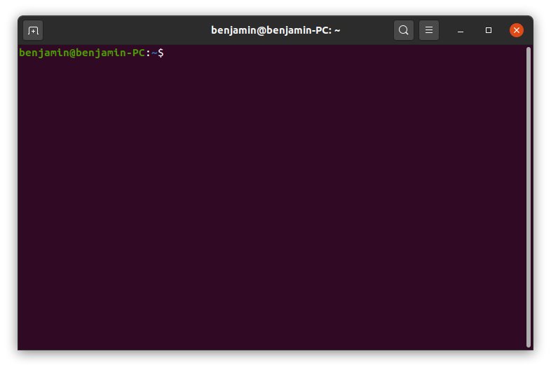
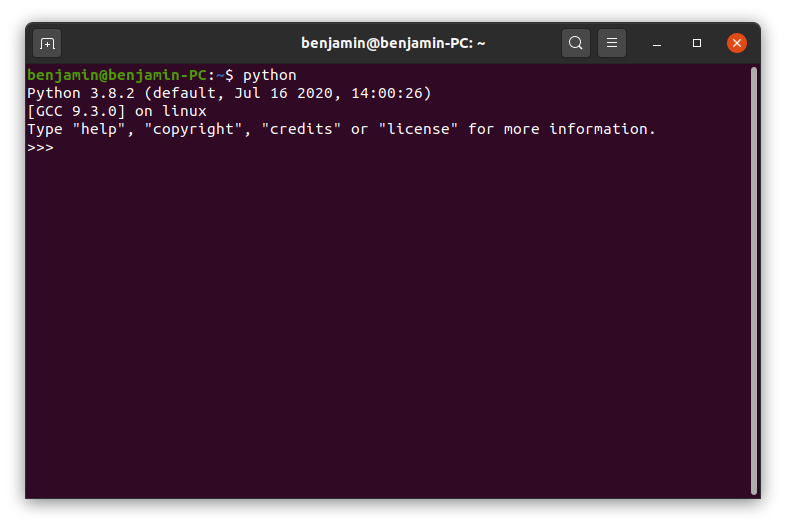
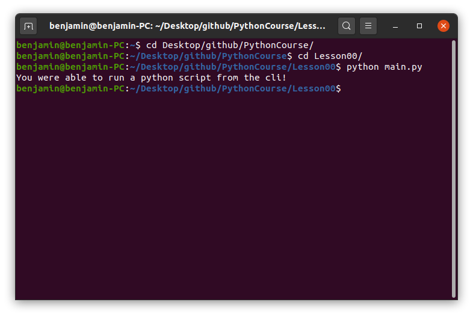

# Installing Python

To begin writing scripts in Python and run code, we first need to make sure Python is installed. \
There are many different versions of python available, but for this course we will be using Python3. \
More specifically Python 3.8+. \
\
To install Python, download it [here](https://www.python.org/downloads/). \
Make sure to select the correct OS. \
Also make sure the download version is at least Python 3.8 or higher. \
\
The actual installation is simply following the steps given by the installer. \
There is only one **IMPORTANT** thing to keep in mind during installation. \
We will need to use python through commands, this means it needs to be installed and added to your PATH. \
During the installation an option will be presented to do this for you. \

You want to make sure you select this option \
\
If an issue arises during the installation, then this is the perfect time to brush up your googling skills :)

# Python terminal

If the installation of Python went well, you should be able to open a terminal and call Python. \
**On Windows** You can open the start-menu (windows key on the keyboard) and type `cmd`. \
**On Linux** You can press `ctrl-alt-T` to open a new terminal. \
**On Mac** You can go to Google, and find out how to open a terminal. \
\
Once a terminal window is open, simply type `python`. \
It should look like this. (example is on Linux) \
\
**New terminal** \

**Python comand** \

\
Once we have the Python terminal open, we can start writing Python code directly in the terminal. \
This is however mostly for testing small things, since you're not actually writing it in a file. \
We are not actually going to use the python terminal in this course. \
\
To exit this Python terminal and go back to the normal terminal type `exit()` and press enter.

## Running Python code

In order to execute code we can write it directly in the Python terminal, or we can write it in a file. \
But once we have code in a file, we need to do a bit of extra work to actually run the code. \
For this lesson, I have prepared a file that we will run. \
\
To run this file, make sure you are in the correct directry. \
\
**On Windows and Linux** \
type `cd <the location where you cloned this repository>`, this will take you to the repository folder. \
Then enter the directory for lesson00 by typing `cd Lesson00`. \
\
**On Mac** Google may know what to do. \
\
Once we are in the correct location type `python main.py` in your terminal (*NOTE* I'm talking about the normal terminal). \

\
As you can see, the line `You were able to run a python script from the cli!` got printed to the screen. \
Not too exciting, but we now know how to run Python code that is inside a file. \
In the next lesson, we will begin creating our own Python code in a file.

## Exercises

The only exercise in this lesson is to try and run the `main.py` file from the terminal. \
\
In the following courses, the exercises will be listed in a seperate file. This is to allow you to try them without looking at the lesson. \
This should encourage you to try them without looking first, and only if you are stuck to go look back at the lesson. \
\
[Next Lesson](../Lesson01)
