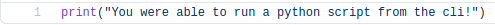

# Introduction

To make a python script, you need to simply create a file with the `.py` extension. \
This script can then be edited using any text editor. \
To run the file, as seen before we call `python <script>.py`. \
\
The script file can be created anywhere, for this course we will create a new repository on github. \
This repository will contain all the exercises per lesson.

## Creating a repo on github

First of all, you need an account on github, but since this course is posted on github, I will assume you already have this. \
Next, you need to create a new repo on github. \
 - TODO: explain how to do this?
\
Clone this new repository to your computer. \
Per lesson you will create a new folder, by the same name as the lesson you are currently taking. (`Lesson01` in this case) \
This folder will then contain a folder for each exercise in this lesson. (`Exercise 1` for example) \
These exercise folders will then contain the actual exercises. \
\
Exercises will be listed on the bottom of each README file per lesson. \
Any other examples given will also be included in the repo, this includes scripts shown through screenshots.

## Printing messages

In [Lesson00](../Lesson00/) we ran a script called `main.py`, this script showed a message to the user. \
Now we will learn how to do this ourselves. \
\
If you were to open up the [script from last lesson](../Lesson00/main.py), you can see what the code looks like. \

\
As you can see, it is only one line of code. \
A `print` is called, this `print` name is what is called a `method`. \
For now, it is not yet important what the word `method` means. \
All you need to know is that calling `print` with parentheses (brackets -> `(` and `)`) will allow you to show messages on the screen. \
\
What exactly you will display depends on what you put between the parentheses. \
As seen in the [script from last lesson](../Lesson00/main.py) some text was shown. \
Text in most programming languages, including Python, is encased in quotation marks (`"`). \
So in order to print another message, all you would need to do is change what is between those quotation marks. \
**Example** \

## Exercises
### Exercise 1

Create a Python script called `Exercise1.py` and open it. \

