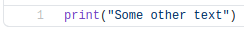
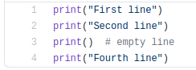
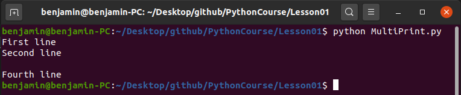

# Introduction

To make a python script, you need to simply create a file with the `.py` extension. \
This script can then be edited using any text editor. \
To run the file, as seen before we call `python <script>.py`.

## Indentation

Most programming languages today make use of the `;` symbol to let the compiler know the line of code has reached it's end. \
Python does not require this however. Instead Python just reads to the end of a line. \
\
Another big difference is indentation, where most languages don't require your code to be indented. \
Instead these languages rely on grouping code into codeblocks through the use of curly brackets. \
Python however does require this, and will crash if you do not follow the rules. \
\
The specifics of this are not yet important, and will be handled later. \
The reason I am still mentioning it is because a simple space may crash your program, even if your program is only a few lines of code. \
What you need to know for now is that your code should not contain any spaces before the actual code. \
What I mean by that is this. \
```python
# Good line of code
my_name = "Jeff"

# Bad line of code
  my_name = "Also Jeff"
```
so for now, just make sure your code is always all the way to the left. \
\
If you ever run python code, and you see an `IndentationError`, that means you messed up, and put some spaces where they didn't belong.

## Printing messages

In [Lesson00](../Lesson00/) we ran a script called `main.py`, this script showed a message to the user. \
Now we will learn how to do this ourselves. \
\
If you were to open up the [script from last lesson](../Lesson00/main.py), you can see what the code looks like. \

\
As you can see, it is only one line of code. \
A `print` is called, this `print` name is what is called a `method`. \
For now, it is not yet important what the word `method` means. \
All you need to know is that calling `print` with parentheses (brackets -> `(` and `)`) will allow you to show messages on the screen. \
\
What exactly you will display depends on what you put between the parentheses. \
As seen in the [script from last lesson](../Lesson00/main.py) some text was shown. \
Text in most programming languages, including Python, is encased in quotation marks (`"`). \
So in order to print another message, all you would need to do is change what is between those quotation marks. \
**Example** \

\
We can also add multiple print statements in a row. \
**Code** \
 \
**Output** \

\
A few new things got introduced here. \
The `print` statement not only shows a message to the user, but also makes sure the next output is shown a line lower. \
This causes the second print message to show it's message on the line below the first one. \
\
Another new thing is an empty `print` statement (line 3). \
If `print` is called without anything to print, it will print an empty line. \
\
A third thing is comments, comments are text that the programmer can see, but the program ignores them. \
A comment in Python looks like this:
```python
# Comment
```
Anything written after the `#` symbol will be treated as simply text by your computer, and will thus do nothing in your program. \
This is a good way to write down what a piece of code does, so you or anyone else can know without having to read the actual code.

## Variables

A variable is a way of saving a value by linking it to a name. \
We basically decide on an own name for our variable, and then give it a value. \
Some examples of what this may look like in code:
```python
number = 12
string = "Hello"
boolean = True
list_of_numbers = [1, 3, 5, 1, 12, 15, 3]
dictionary = {"first name": "John", "last name": "Smith", "age": 24}
person = Person(first="Jane", last="Doe", age=26)
```
\
As you can see, a variable can have any name you want, although there are some restrictions. \
 - A variable name must start with a letter or underscore
 - A varable name cannot start with a number
 - A varable name can only contain letters, numbers, and underscores
 - Variable names are case-sensitive, meaning that `age` and `Age` are two different names
 - Spaces can not be used in a variable name, so `first name` would not be a valid variable name but `first_name` would be
\
Most programming languages have their own set of guidelines to follow when writing code, and Python is no different. \
However, these guidelines are not enforced, and thus do not HAVE to be followed. \
 - A variable name does not start with a capital letter (this rule has an exception but is not important yet)
 - If your variable name is made up of different words, you put an underscores between each word (`first_name`)
 - Attempt to prevent the use of numbers in your naming (although this rule is quite unspoken)
 - Your name should give a description of the value it will contain (so, try to prevent using variables that are just one letter)

### Values

The reason we put a value into a variable is so we can use it again later in code. \
**Example**
```python
welcome_message = "Hello there, welcome!"

print(welcome_message)
```
\
Ofcourse, in the example shown it is quite unnecessary to use a variable, since we only print it. But it serves to show how the variable can be used. \
Something to keep in mind is that a variable can be overwritten, for example. \
```python
some_string = "Text"
some_string = "Different text"
```
In this case, only one variable is created (`some_string`), we assign a value to it ("Text") and then overwrite it by assigning a different value ("Different text"). \
So just remember, if you want to create a new variable, make sure the name is not already in use. Otherwise you might be changing values that you did not wish to change. \
\
As we saw before, there are a number of different values that can be stored in a variable. \
For now we will only focus on two of the simpler ones, numbers and strings.

### Numbers

Numbers are quite self explanatory, a number is a number. \
A number can be positive, negative and contain a comma. \
```python
number_one = 5
number_two = 7.5
number_three = 1e52
number_four = -46.15
```
These values can also be shown to the user through `print`, this will just show the value in the terminal. \
```python
number = 15.3

print(number)
```
\
Ofcourse, simply storing numbers is no fun. But as you might have guessed, we can use some arithmetic to make things more interesting. \
Let's look at what Python provides in the way of arithmetic first. \
 - Addition (+)
 - Subtraction (-)
 - Multiplication (*)
 - Division (/)
 - Modulus (%)
 - Exponent (**)
 - Floor division (//)
\
So, we have a few options, for now we will only be looking at the four basic operations since they are most used. \
Addition, subtraction, multiplication and division should be simple, but here are some examples of how to use them in code. \
```python
number_one = 15 + 3  # 18
number_two = number_one - 5.2  # 12.8
number_three = number_two / 2  # 6.4
number_four = number_three + 5  # 11.4
```
As you can see, I am reussing the other variables to chain operations together. \
This way, we can store the intermediate values should we need them. However, let's say we are only interested in the end result. \
So we only want the value stored in `number_four`, this means the other values don't need to be stored in variables. \
We can create this chain in one line, which would look like this. \
```python
number = (((15 + 3) - 5.2) / 2) + 5  # 11.4
```
Right now, I have put extra brackets in there to show how they are still the same operations as before. \
But most of these are not required, since Python follows the basic rules of order of operations. \
If I were to remove the unneeded ones, it would look like this. \
```python
number = (15 + 3 - 5.2) / 2 + 5  # 11.4
```
However, this way of writing it seems to cause confusion for some people, so if you feel more comfortable with more brackets, to make sure everything happens in the correct order then you can do so. \
Otherwise your math might end up on Facebook with people arguing over the `correct` answer. \
\
Sometimes you might notice that the value you expected is not exactly what Python gives. \
For example, if we were to run the following code. \
```python
number = 19.2 + 0.1 + 0.1  # 19.4

print(number)
```
We would expect the value `19.4` to be printed, however what we actually see is `19.400000000000002` \
The reason for this has to do with how values are stored in memory. \
Usually this does not create an issue, but it is something to keep in mind.

### Strings

We have already seen strings a few times in examples now, they look like this `"Some text"`. \
A string is text, although it can also contain numbers, symbols, and even some more exotic symbols like smileys. \
For now, we will simply keep it to text, numbers and symbols though. \
\
Storing a string in a variable can look like this \
```python
text = "Some text"
```
As mentioned before, there is not much that can't be part of a string, although some more complex symbols may need to be encoded. \
But that is not important right now, so we will ignore it like it's a pile of dirty clothes sitting on a chair. \
\
As we have seen before, strings can be shown to the user through `print`. \
```python
hello = "Hello!"

print(hello)
```
\
We can also combine strings in a few ways. \
The simplest is to simply concatenate them, meaning to put one after the other. \
```python
first_name = "Jeff"
last_name = "Dunham"
full_name = first_name + " " + last_name

print(full_name)  # Jeff Dunham
```
To concatenate strings, we can just use the `+` operator, like we did with numbers. \
But we can also make use of string formatting if we have more things that need to be combined in a more complex way. \
This formatting can be done in a few ways, we will be looking at the newest, and in my opinion cleanest way of doing it. \
PS. This way only works if you are using Python3.7+ (which is the case for this course). \
```python
first_name = "Karen"
age = 34
hobby = "asking for the manager"
occupation = "stay at home mom"

full_text = f"My name is {first_name} and I am {age} years old.\nMy hobby is {hobby}, and my occupation is being a {occupation}."

print(full_text)
# My name is Karen and I am 34 years old.
# My hobby is asking for the manager, and my occupation is being a stay at home mom.
```
\
The formatting starts by putting the letter `f` before the start of your string, this signifies to Python that you are writing a formatting string. \
Every time you want to add a value (which is contained in a variable) into your string you need to enclose it in curly brackets `{}`. \
This way Python knows that it must use the value stored in the variable. \
\
One last thing I added here was `\n`. This is treated as a special character in a string and represents a newline. \
As you can see in the output (the comments), `print` actually printed 2 lines instead of just 1. \
This is thanks to the `\n` character. Which basically means to put an `enter` there, so everything after it will be on a new line. \
This can be very handy if you have a very long string, but want to show it to the user in multiple lines. \
\
[Exercises](Exercises.md) \
[Next lesson](../Lesson02)