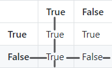

# Editors

As I mentioned in the [previous lesson](../Lesson01) a simple text editor can be used to edit and write Python code. \
But it is almost always a good idea to use a code editor, of which there are hundreds. \
My code editor of choice is [Visual Studie Code](https://code.visualstudio.com/). \
\
These code editors usually allow for easier coding, code-completion being one of the most handy features. \
It is by no means a requirement to use a code editor, but I would highly recommend it.

# User input

At this point, all we have seen is how to `hardcode` certain values, which means the values were already decided before the program was run. \
But we don't always know the values before the program is running. \
Let's say we want to ask a person for his name and age, we won't be able to know ahead of time who is going to be running the program, and thus we can't know his name and age yet. \
This is where user input can be useful. This is a way to ask the user for his information, and then use that information in our program. \
\
In python you can ask for a user's input through the `input` statement. \
Much like the `print` statement we can give a message which will be shown to the user, the difference being that input will then wait for the user to enter some information. \
```python
name = input("Please enter your name: ")
```
A few things to take away from this:
 - anything the user types will be stored inside a string, so the type of our variable `name` will be a string, even when the user only enters a number
 - when entering a message to show to the user (`"Please enter your name: "`) notice how I left a space after the `:` symbol. This is because the user will be typing something directly behind this message, and if we don't provide the empty space, it will look messy for the user. (but this is not required, just a preference) \
This code will work for our name, since our name needs to be a string, and input provides us with a string. \
However, once we require the user to enter his age, this won't do what we want it to do. \
The age will also be a string, but we want it to be a number. \
\
In order to transform this string into a number we need to `cast` it. \
For now it is not important to know what exactly it means to `cast` a variable to a different type. \
Just try to remember this specific use-case for now. \
```python
age = int(input("Please enter your age: "))
```
This code will make sure the age will be stored as a number (an integer to be exact, so no comma allowed). \
If the user enters something other than a number here the code will crash. But for now we will assume the user always enters the information correctly.

# Booleans

When we're talking about different values, we have seen 3 variaties at this point. We have seen: numbers, strings and lists. \
Now we will be adding a fourth, `booleans`. \
\
Booleans are variables that can only contain one of two values: `True` or `False`. \
A boolean is usually used to represent whether or not a certain condition has been met. \
To better explain this let's start with logical operators.

## Logical operators

Logical operators are used to determine whether something is `True` or `False`, which sounds very vague, but is about as specific as I can be. \
Python contains 6 basic logical operators that can be used:

|Name|Symbol|Use-cases|
|-|-|-|
|Equality| == | anything | 
|Inequality| != | anything |
|Greater than| > | numbers |
|Greater than or equal to| >= | numbers |
|Less than| < | numbers |
|Less than or equal to| <= | numbers |

The use of these operators in code is quite simple: `<value> <operator> <value>` \
Some examples: \
```python
15 == 13            # False
"hello" != "hello"  # False

12 > 3              # True
16.5 >= -5          # True

12.6 < -19.2        # False
15 <= 16.2          # True
```
Something Python does that not many other programming languages allow is to check multiple things at once. \
What I mean by that is to check if a value is both smaller than some other value and larger than another at the same time. \
```python
15 > 10 > 3         # True
```
This works with any combination of the operators, but is mostly used for the use-case I just showed. \
To understand how this works under the hood we need to look at boolean operators first.

## Boolean operators

Boolean operators are ways of chaining logical operators. \
Let's say you want to check if a user is named `Jack` and he is at least 18 years old. \
```python
name = input("Please enter your name: ")
age = int(input("Please enter your age: "))

name == "Jack" and age >= 18 
```
The keyword `and` is the boolean operator in this case. \
The effect should be relatively obvious. Both comparisons need to be `True` in order for the entire thing to be `True`. \
If either one of them is `False` then the entire thing will be `False`. \
\
These are all the boolean operators currently available in Python:

|Name & symbol|
|-|
|and|
|or|
|not|

Both the `and` and `or` operator are quite obvious, but to show what they do I will show their `truth tables`. \
A truth table is a way of determening what the value is going to be when using these operators.

**and**
||True|False|
|-|-|-|
|**True**|True|False|
|**False**|False|False|

**or**
||True|False|
|-|-|-|
|**True**|True|True|
|**False**|True|False|

**not**
|**True**|**False**|
|-|-|
|False|True|

The values in **bold** are the values that we are using together with the operator. \
The result is the value which can be found where the initial values cross. \
Which is a very vague and confusing explanation, but it is really quite simple. \
\
Let's say we want to know what happens when we do `True or False`, we look at the truth table for `or`. \
We look at the **True** in the first row, and the **False** in the last row. \
To figure out what the endresult will be we imagina a vertical line running through the **True** all the way down. \
And we imagine a horizontal line through the **False** all the way to the left. \
The point where they cross tells us what the result will be. \
 \
As you can see, the result is `True`. \
\
In the case of `not`, whatever the value was, it simply gets reversed. \
\
\
Now we can finally get back to how something like `15 > 10 > 3` works. \
Python basically understands that all you are trying to do is `15 > 10 and 10 > 3`. \
Which means you are spared some extra work.

# If-statement

Now we know how to get boolean values by comparing values, but what can we do with them. \
We can make certain code only execute when a boolean value is `True`, or the other way around. \
This is what an `if`-statment is. A codeblock which only gets executed if a condition is met. \
\
Let's say we want to check if a person is old enough to drink alcohol.
```python
legal_drinking_age = 18

age = int(input("Please enter your age: "))

if age >= legal_drinking_age:
    print("You are old enough to drink")
else:
    print("You are not old enough to drink yet")
```
In this code we first ask the age of the user, and then check if he/she is old enough to drink. \
We could also have stored the boolean value in a variable if we wanted to. \
In that case the code would look like this.
```python
legal_drinking_age = 18

age = int(input("Please enter your age: "))

is_allowed_to_drink = age >= legal_drinking_age

if is_allowed_to_drink:
    print("You are old enough to drink")
else:
    print("You are not old enough to drink yet")
```
This code does exactly the same, but may be more readable, so it is up to your own preference. \
If you feel that the line `is_allowed_to_drink = age >= legal_drinking_age` looks too messy, you can put brackets around the boolean logic, like this: `is_allowed_to_drink = (age >= legal_drinking_age)` \
The same could be done if we wrote the code without the variable: `if (age >= legal_drinking_age):` \
But once again, this is up to personal preference, and not forced by Python. \
\
In the code we check if the user has the correct age, and if he does, we print `You are old enough to drink`. \
This print only happens if the user is older than or equal to the legal drinking age. \
If this is not the case, the code in the `else`-block gets executed, meaning that `You are not old enough to drink yet` gets printed. \
\
Something to notice here, is once again the use of codeblock, where we start with a `:` symbol after the `if`, and again after the `else` \
Since they are codeblocks, indentation is once again important, or Python will start complaining. \
\
Now you know what the keywords `if` and `else` are used for, there is however a third related keyword: `elif` \
An example would like this:
```python
age = int(input("Please enter your age: "))

if age >= 18:
    print("You are an adult")
elif age >= 13:
    print("You are a teenager")
else:
    print("You are a child")
```
This code asks for the age of the user, and then tells them they are either an adult, a teenager ot a child. \
First, we check if the user is old enough to classify as an adult (18+), if so we tell the user they are an adult. \
Otherwise, we go on, the `elif`-statement then gets checked, which can be seen as an `if`-statement, so if the user is older than 13, he is considered a teenager. \
If this is not `True` either, the user is a child. \
\
Now, I said:
> the `elif`-statement then gets checked, which can be seen as an `if`-statement

Then why don't I just use an `if`-statement? \
Let's see what this code would do:
```python
age = int(input("Please enter your age: "))

if age >= 18:
    print("You are an adult")
if age >= 13:
    print("You are a teenager")
else:
    print("You are a child")
```
 \
2 lines got printed instead of 1, why is this? \
As we saw with `if-else`-statements (so where we only used `if` followed by an `else`), only one of the two codeblocks ever executed. \
The reason for this is because they are linked, do only one of them can ever run. \
\
The same is true when using a `if-elif-else`-statement, but not when using a new `if`-statement, since it is seen as a seperate thing. \
Thus python first checks the first `if`, finds our value is `True`, and executes the code. \
It then does the same for our second `if`, where the `else` does not get executed, because the connected `if` already got run. \
\
This does however accidentaly point out something about `if`-stamtents. \
There is no need for a connected `else`-statement to exist. So if the value that gets checked by the `if` is `False`, the codeblock will just get skipped. \
\
Another thing to note is that there is no limit to how many `elif`-statements you can chain:
```python
scoops_of_ice_cream = 12

if scoops_of_ice_cream > 5:
    print("You are eating more than 5 scoops of ice cream")
elif scoops_of_ice_cream > 7:
    print("You are eating more than 7 scoops of ice cream")
elif scoops_of_ice_cream > 9:
    print("You are eating more than 9 scoops of ice cream")
elif scoops_of_ice_cream > 11:
    print("You are eating more than 11 scoops of ice cream")
elif scoops_of_ice_cream > 13:
    print("You are eating more than 13 scoops of ice cream")
    
...
```
\
\
[Exercises](Exercises.md) \
[Next Lesson](../Lesson03)