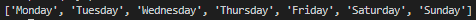
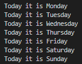

# Lists

Python provides a few ways to create list-like objects. Each with different advantages and drawbacks. \
We will only be looking at lists in this lesson. \
\
A list is a way of storing many values in one single variable. \
In the [previous lesson](../Lesson01) we saw how a value can be linked to a variable. \
But let's say we have a whole bunch of values, and we want to have all of them available to us, but don't want to make a variable for each one. \
That is why lists exist. \
\
In code a list looks like this. \
```python
list_of_numbers = [1, 12, 35, 6, 78, 1, 12, 35, 6]
```
In this case our list only contains integers (numbers without comma). \
Most programming languages only allow one type of value to be contained per list. This is however not something Python forces you to do. \
That means something like this works just fine. \
```python
list_of_things = [1, -0.2, "some text", ["yet", "another", "list", 2], Person(first="Hank")]
```
\
As a more practical example, let's say we have a list containing the name of each day. \
```python
days = ["Monday", "Tuesday", "Wednesday", "Thursday", "Friday", "Saturday", "Sunday"]
```
It's very cool (debatable) that we have a list containing the days now, but how do we use it? \
Let's say we want to retrieve the string for `Thursday`. \
What we need to do is tell Python we want a specific value inside of this list. \
To do this we need to provide Python with the correct `index`. \
This `index` is an integer value which denotes the position of the value we want. \
\
An important thing to remember is this `index` value is 0-based. Meaning that to get the very first value, we need to use `index` 0. \
This can be confusing at first, but you will get used to it in no time at all. \
\
So, to retrieve `Thursday` from the list, we need to look at which position it has, and we just start counting from 0. \
So that makes: `Monday` index 0, `Tuesday` index 1, `Wednesday` index 2, and finally `Thursday` index 3. \
\
Now we now we need to tell Python to give us index 3. \
To actually do this in code, it would look like this. \
```python
days = ["Monday", "Tuesday", "Wednesday", "Thursday", "Friday", "Saturday", "Sunday"]

day = days[3]  # Thursday
```
\
One last thing to mention for now, is that lists can be printed directly using the `print` statement. \
```python
days = ["Monday", "Tuesday", "Wednesday", "Thursday", "Friday", "Saturday", "Sunday"]

print(days)
```
The output would look like this. \


# Loops

At times we may need to use more than one value in a list, in which case it is sometimes easier to loop through all of the values. \
Let's say in the example of the days, we want to print each one of the days in a string that looks like this `f"Today it is {day}"`. \
It would be very tedious to manually tell it to use index 0 first, then index 1, ... \
\
What we can do instead is loop through all of the values in the list and use them in our string. \
There are 2 types of loops in Python, a `for`-loop and a `while`-loop. \
Each coming with it's different use-cases. \
\
A `for`-loop loops through every value in a list. \
A `while`-loop keeps looping while a certain condition remains `True`, this will be clarified later. \
\
For our example we require the `for`-loop.

## For-loop

Let's look at a `for`-loop in code for our example. \
```python
days = ["Monday", "Tuesday", "Wednesday", "Thursday", "Friday", "Saturday", "Sunday"]

for day in days:
    print(f"Today it is {day}")
```
The syntax when writing a `for`-loop is as follows: **for** `<variable_name>` **in** `<list>`**:** \
The keywords `for`, `in` and the symbol `:` never change. \
The `<variable_name>` is free to choose, but should try to follow the same rules as any other variable. \
The `<list>` is the variable which contains our values, so the actual list. \
\
Something else to note is that the `print`-statment inside our `for`-loop is indented. \
If you remember from the [previous lesson](../Lesson01), I mentioned that Python uses indentation instead of curly brackets to form codeblocks, which can be seen here. \
In a lot of other programming languages, you tell the compiler where a block of code starts and ends using curly brackets, for example. \
```java
for (int i = 0; i < 10; i++) {
    System.out.println(i);
}
```
This code, written in java, is also a `for`-loop, although it is different from a Python `for`-loop. \
But what is important is we told the compiler where our code for the `for`-loop starts and ends by using the curly brackets. \
This is not how Python works with codeblocks. Instead Python just requires you to start a codeblock by using the `:` symbol, and then indent every line of code which belongs to that block. \
Once you stop indenting, the codeblock is considered closed. \
\
Those were a lot of words to say something quite simple. \
Everything inside our `for`-loop needs to be indented, how you indent it is your own choice, but you need to be consistent or Python will not allow it. \
For example, you can indent using a single space infront of your lines of code. Or you can put 2 or more spaces. \
But probably the most used is placing a tab before each line. \
\
As I mentioned though, consistency is required, so you can't just indent one line by 1 space, and then indent the next line by 2. \
If you try to do this, Python will throw an `IndentationError` and your code will not work. \
\
Finally, after all of this explaining, this is what the output from our code would look like. \


### Range

Something which gets used quite often when working with `for`-loops is the method `range`. \
```python
for i in range(10):
    print(i)
```
`range` creates a list-like object of integers based on what we specify we want. \
We can specify at which integer we want the list to begin, at which value we want it to end, and how much to increase the value each time. \
Although we do not need to provide all of this information at once. \
Here are some more examples of what you can do with `range`. \
```python
# All values from 0 up to 9 (so 10 is not included)
range(10)
# OR
# range(0, 10)
# OR
# range(0, 10, 1)

# All values from 2 up to 9
range(2, 10)
# OR
# range(2, 10, 1)

# Every even number from 2 up to 9 (so [2, 4, 6, 8])
range(2, 10, 2)
```
We can provide 1, 2 or 3 integers based on what we need. \
If we only provide 1 value, the values will always be from 0 up to the value we gave, but remember, the actual value we gave is not included in the values. \
If we provide 2 values, the first value tells the range where to begin, and the second tells it where to stop. \
If we provide 3 values, the first tells it where to begin, the second where to stop and the last the step size.